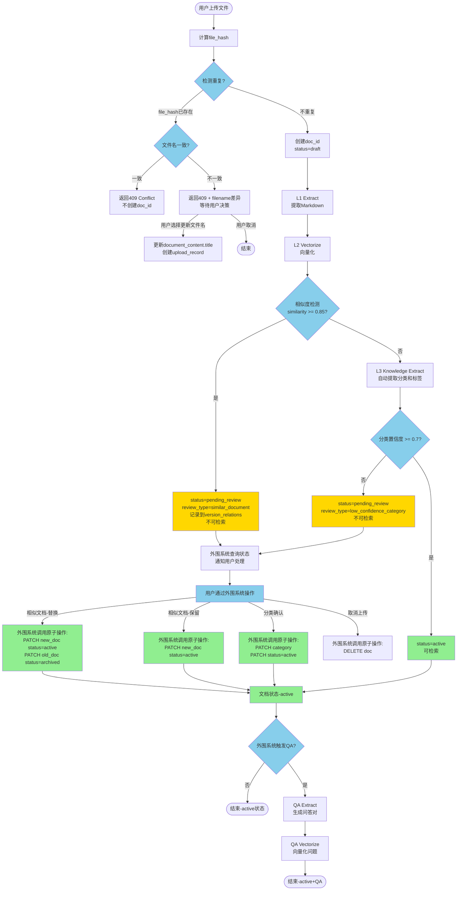
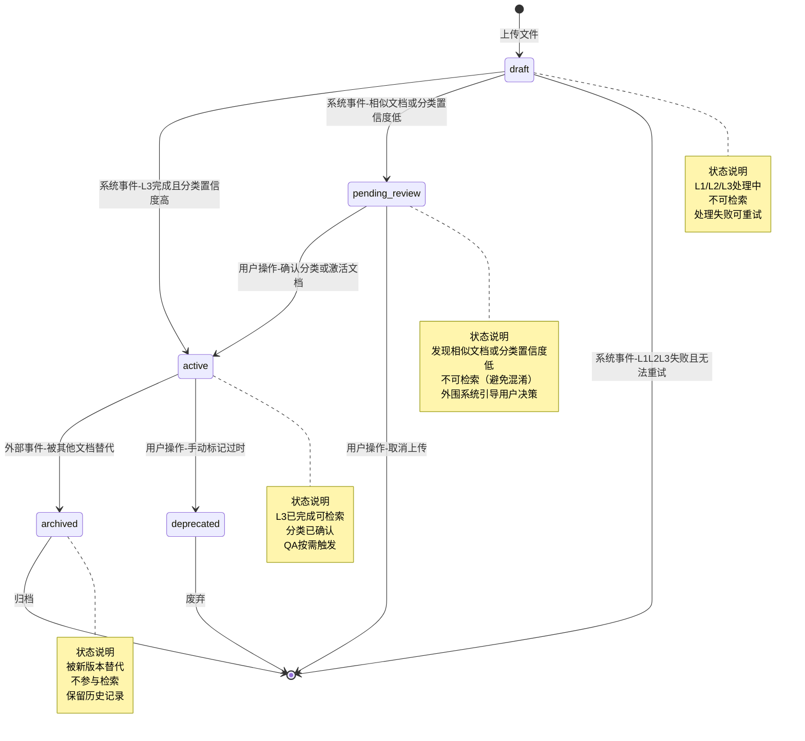
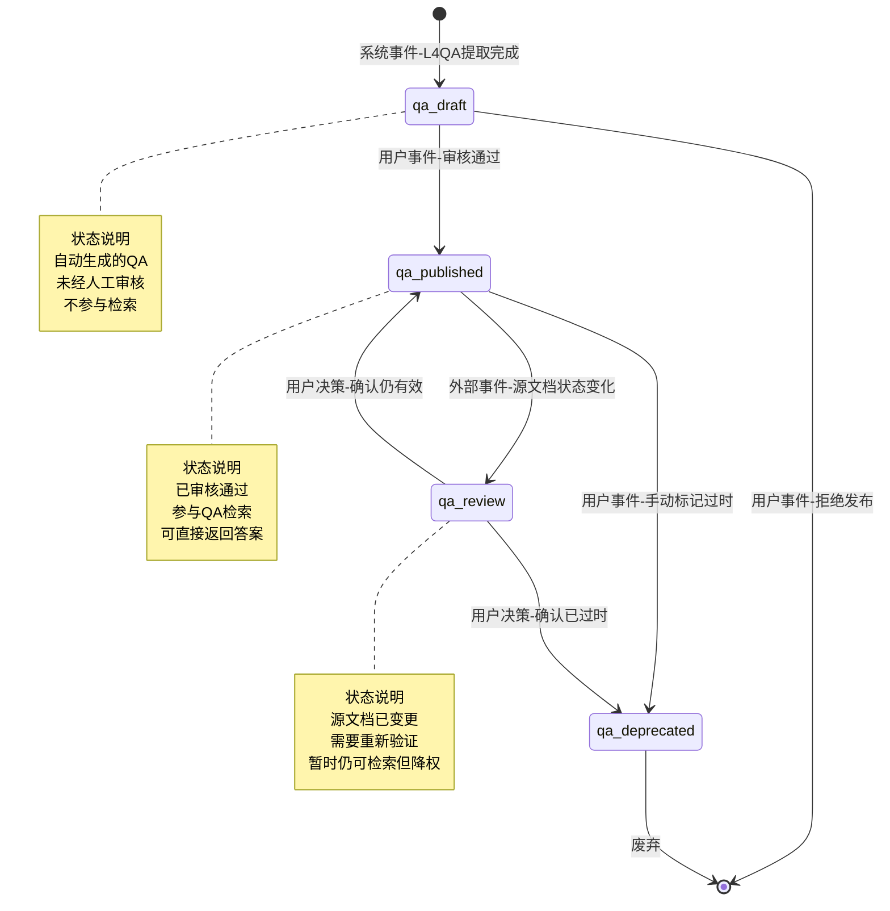

# TaxKB 文档生命周期管理 - PRD

**版本**: v1.0
**创建日期**: 2025-12-03
**作者**: TaxKB Team
**状态**: 设计完成

---

## 目录

- [一、背景与目标](#一背景与目标)
- [二、用户场景](#二用户场景)
- [三、服务能力需求](#三服务能力需求)
- [四、业务流程](#四业务流程)
- [五、文档生命周期设计](#五文档生命周期设计)
- [六、关键流程细化](#六关键流程细化)
- [七、API设计](#七api设计)
- [八、潜在问题思考](#八潜在问题思考)
- [九、未来扩展性](#九未来扩展性)

---

## 一、背景与目标

### 1.1 背景

TaxKB作为知识库服务，需要处理大量企业政策文档的上传、提取、检索。在实际使用中，存在以下痛点：

1. **重复上传**：同一文档被多次上传，浪费存储和计算资源
2. **版本混乱**：同一政策的新旧版本共存，用户不知道用哪个
3. **分类困难**：部分文档主题特殊，自动分类失败，影响检索质量
4. **质量不可控**：自动提取的标签和QA对质量参差不齐，缺乏人工干预机制

### 1.2 目标

设计一套**完整的文档生命周期管理机制**，实现：

1. **自动检测异常**：重复文档、相似文档、分类失败等
2. **暴露真实状态**：通过清晰的状态机反映文档当前情况
3. **解耦决策逻辑**：知识库只负责检测和暴露状态，提供基础操作能力，由外围系统（IM Agent/Dashboard）处理用户交互和决策逻辑
4. **分层加工策略**：基础加工（L0-L2）自动完成，增值加工（L3/QA）按需触发
5. **分类与标签分离**：核心分类（主体、业务领域）为必填字段需确认，内容标签为辅助信息不阻塞检索

### 1.3 设计原则

| 原则 | 说明 |
|------|------|
| **职责边界清晰** | 知识库只暴露状态和异常，提供基础操作能力；外围系统负责用户交互和决策逻辑 |
| **以L2为基础完成点** | L0→L1→L2为基础加工，完成后文档即可检索；L3/QA为增值加工，按需触发 |
| **状态语义化** | status字段表达"文档能不能用"，而非"处理到哪了"（处理进度从jobs表派生） |
| **分类与标签分离** | 核心分类（主体、业务领域）为必填字段需确认；内容标签为辅助信息不阻塞检索 |
| **pending_review隔离** | pending_review状态的文档不参与检索，避免重复结果和用户混淆 |
| **异常早发现** | 在上传阶段完成所有检测（file_hash去重、相似度检测），封装在upload流程中 |

---

## 二、用户场景

### 场景1：检测到完全重复的文档（文件名一致）

**角色**：张经理（HR部门）
**场景描述**：

```
时间：周一上午 10:00

💬 张经理通过IM发送消息："小助手，我这有份新的入职指南需要录入系统"
🤖 Agent："好的张经理！您直接把文档发给我就行"
📄 张经理发送文件：2025年新员工入职指南.pdf

--- 知识库处理 ---
1. 计算file_hash: sha256:abc123
2. 检测到document_raw表已存在相同hash
3. 返回409 Conflict + 已存在文档信息

🤖 Agent回复：
   "张经理，我发现这份文档之前已经录入过了！

    📄 已存在的文档：《2025年新员工入职指南》
    📅 录入时间：2025-11-28 09:15
    👤 录入人：张经理

    这两份文档内容完全一样，不需要重复处理。"
```

**期望结果**：
- 知识库返回409状态码，不创建doc_id
- 外围系统决定如何提示用户

---

### 场景2：检测到完全重复但文件名不一致

**场景描述**：

```
📄 张经理发送文件：入职指南2025版本.pdf
（file_hash与"2025年新员工入职指南.pdf"相同）

--- 知识库处理 ---
1. 计算file_hash: sha256:abc123
2. 检测到document_raw表已存在相同hash
3. 发现filename不一致
4. 返回状态信息 + 文件名差异

🤖 Agent回复：
   "张经理，这份文档的内容和之前的一份完全一样，但文件名不同：

    已有文档：《2025年新员工入职指南.pdf》
    新文件名：《入职指南2025版本.pdf》

    您希望：
    1. 使用原有文件名（保持不变）
    2. 更新为新文件名
    3. 取消本次上传"

💬 张经理："用新文件名吧，这个更规范"

--- 知识库处理 ---
调用 PATCH /documents/{doc_id}/metadata
更新 document_content.title
创建新的 upload_record 记录本次上传事件
```

**期望结果**：
- 知识库返回冲突信息，包含两个文件名
- 外围系统询问用户意见，调用更新API

---

### 场景3：检测到高度相似的文档（新版本）

**场景描述**：

```
📄 张经理发送文件：2025年新员工入职指南_v2.pdf

--- 知识库处理 ---
1. file_hash不重复，创建doc_id
2. L1提取完成
3. L2向量化完成，status='active'
4. 后台异步检测相似度（基于doc_embeddings）
5. 发现相似文档（similarity=0.92）
6. 更新status='pending_review', review_type='similar_document'
7. 记录到version_relations表

🤖 Agent查询文档状态，发现pending_review，读取details

🤖 Agent回复：
   "张经理，我注意到这份文档和之前的一份很相似！

    📄 相似文档：《2025年新员工入职指南》
    📊 相似度：92%
    📅 录入时间：2025-11-28 09:15

    主要差异：
    • 新版增加了「体检医院地址和电话」
    • 新版更新了「银行卡要求」说明

    您是想用新版本替换旧版本，还是保留两个版本？"

💬 张经理："用新版本替换吧，旧的可以归档"

--- 知识库处理 ---
调用 POST /documents/{doc_id}/decisions
{
  "decision_type": "replace",
  "related_doc_id": "doc_old"
}

知识库执行：
1. 更新旧文档：status='archived', reason='被doc_new替代'
2. 更新新文档：status='active', parent_doc_id='doc_old'
3. 更新version_relations: relation_type='version'
4. 旧文档的QA标记：status='pending_review'
```

**期望结果**：
- 知识库检测到相似文档，自动暂停处理
- 返回相似度和差异信息
- 外围系统决定如何展示和收集用户决策

---

### 场景4：检测到相似文档（不同主体变体）

**场景描述**：

```
📄 李经理发送文件：北京办公室考勤管理办法.pdf

--- 知识库处理 ---
1. L2完成后检测到相似文档
2. 相似文档：《上海办公室考勤管理办法.pdf》, similarity=0.89
3. status='pending_review', review_type='similar_document'

🤖 Agent回复：
   "李经理，这份文档和「上海办公室考勤管理办法」很相似（相似度89%）

    主要差异：
    • 主体不同：北京办公室 vs 上海办公室
    • 部分条款数值不同

    这可能是同一政策的地区变体，您希望：
    1. 作为独立文档保留（建议）
    2. 替换旧文档
    3. 取消上传"

💬 李经理："保留两个版本，是不同地区的"

--- 知识库处理 ---
调用 POST /documents/{doc_id}/decisions
{
  "decision_type": "keep_both"
}

知识库执行：
1. 更新新文档：status='active'
2. 更新version_relations: relation_type='variant'
```

**期望结果**：
- 知识库识别出相似但非版本关系的文档
- 提供差异信息，由用户决定是variant还是version

---

### 场景5：上传无法自动分类的文档

**场景描述**：

```
📄 张经理发送文件：员工心理健康咨询服务指南.pdf

--- 知识库处理 ---
1. file_hash不重复，创建doc_id
2. L1提取完成
3. L2向量化完成
4. 自动分类（基于LLM）：
   - "公司主体": confidence=0.55 (< 0.7)
   - "业务领域": confidence=0.60 (< 0.7)
5. 因核心分类置信度低，status='pending_review', review_type='low_confidence_category'
6. 保存低置信度分类：source='auto', verified=false

🤖 Agent查询文档状态，发现pending_review

🤖 Agent回复：
   "张经理，我收到这份「员工心理健康咨询服务指南」了！

    我不太确定这份文档应该归到哪个分类，需要您帮忙确认：

    📋 我的猜测（不确定）：
    • 公司主体：北京总部？（置信度55%）
    • 业务领域：员工关系/员工服务？（置信度60%）

    您能帮我确认一下吗？"

💬 张经理："归到「员工关系/员工服务」，主体是「集团总部」"

--- 知识库处理 ---
调用 PATCH /documents/{doc_id}/category
{
  "company_entity": "集团总部",
  "business_domain": "员工关系/员工服务"
}

知识库执行：
1. 更新document_category表：source='manual', verified=true
2. 更新文档状态：status='active'
3. 文档现在可以正常检索
```

**期望结果**：
- 核心分类（主体、业务领域）必须确认后才能激活文档
- 分类确认后，文档从pending_review → active
- 内容标签（tag）不影响此流程，可后续补充

---

## 三、服务能力需求

从上述场景推导出的知识库服务能力需求：

### 3.1 文件去重能力

| 能力 | 说明 |
|------|------|
| **file_hash计算** | 对上传文件计算SHA256，唯一标识文件内容 |
| **重复检测** | 查询document_raw表，检测file_hash是否已存在 |
| **文件名对比** | 当hash重复但filename不一致时，返回冲突信息 |
| **上传记录追踪** | 每次上传事件都记录到upload_records，支持多来源追溯 |

### 3.2 相似度检测能力

| 能力 | 说明 |
|------|------|
| **向量相似度查询** | L2完成后，利用LanceDB的向量检索能力，快速查找相似文档 |
| **阈值分级** | similarity ≥0.95: version; 0.85-0.95: variant; 0.7-0.85: similar |
| **关系记录** | 将相似关系存入version_relations表，支持关系图谱查询 |
| **差异分析（可选）** | 基于markdown内容diff，提取主要变化点（v2功能） |

### 3.3 分类与标签管理能力

| 能力 | 说明 |
|------|------|
| **核心分类** | document_category表：公司主体、业务领域为必填字段 |
| **分类置信度检测** | 自动分类置信度 < 0.7 时，文档进入pending_review等待确认 |
| **内容标签** | document_tags表：可选的辅助标签，不阻塞文档检索 |
| **分类与标签分离** | 分类决定文档能否激活；标签仅用于辅助检索和统计 |

### 3.4 状态管理能力

| 能力 | 说明 |
|------|------|
| **文档状态** | document_content.status字段，反映文档的生命周期阶段 |
| **状态原因** | status_reason字段，记录进入pending_review/archived等状态的原因 |
| **处理进度查询** | 实时从processing_jobs表聚合，返回L1/L2/L3/QA各阶段进度 |
| **pending_review隔离** | pending_review状态的文档不参与检索，避免重复和混淆 |

### 3.5 分层加工能力

| 层级 | 触发方式 | 输出 | 完成标志 |
|------|---------|------|----------|
| **L0** | 自动（上传时） | 文件存储 + document_raw记录 | - |
| **L1** | 自动（L0完成后） | markdown_content + tables + images | - |
| **L2** | 自动（L1完成后） | doc_embeddings + chunks向量 + 自动分类 | 分类确认后status='active' ✓ |
| **L3** | 手动触发API | metadata(摘要/标签) + doc_embeddings(summary) | 元数据更丰富 |
| **QA** | 手动触发API | qa_pairs + qa_embeddings | QA检索可用 |

### 3.6 状态暴露与基础操作能力

| 场景 | 知识库行为 | 外围系统如何处理 |
|------|-----------|-----------------|
| **重复文件名一致** | 返回409 + existing_doc信息 | 提示用户，不再上传 |
| **重复文件名不一致** | 返回409 + filename差异 | 询问用户，调用更新文件名API |
| **相似文档（version）** | 返回pending_review + similar_docs | 询问用户，调用归档旧文档API或激活新文档API |
| **相似文档（variant）** | 返回pending_review + similar_docs | 询问用户，调用激活文档API保留两者 |
| **分类置信度低** | 返回pending_review + 低置信度分类 | 引导用户确认，调用更新分类API |
| **旧文档被归档** | 关联QA进入pending_review | 查询待复核QA，引导用户审核或删除 |

---

## 四、业务流程

### 4.1 完整生命周期流程图



### 4.2 状态转换图

#### 4.2.1 单文档生命周期状态机

以下状态机描述**单个文档**的生命周期，边上标注的是**触发事件**。



**事件分类说明**：

| 事件类型 | 说明 | 示例 |
|---------|------|------|
| **系统事件** | 系统自动触发，无需人工干预 | L2完成、检测到相似文档 |
| **用户事件** | 用户主动操作触发 | 手动标记过时、确认保留文档 |
| **外部事件** | 其他文档的操作触发当前文档状态变化 | 新版本替代旧版本 |

---

#### 4.2.2 文档间关系事件（影响多个文档）

某些用户决策会**同时影响两个文档的状态**，这不是单一状态机能表达的。

**事件：用户决策"用新版本替换旧版本"**

```
触发条件：
  - 新文档(doc_new)处于 pending_review 状态
  - 检测到与旧文档(doc_old)高度相似
  - 用户选择 decision_type='replace'

影响：
  ┌─────────────────────────────────────┐
  │ 新文档 (doc_new)                     │
  │ pending_review ──决策──> active      │
  │ parent_doc_id = doc_old              │
  └─────────────────────────────────────┘
                ↓ (同时)
  ┌─────────────────────────────────────┐
  │ 旧文档 (doc_old)                     │
  │ active ──外部事件──> archived        │
  │ status_reason = "被doc_new替代"      │
  └─────────────────────────────────────┘
                ↓ (关联)
  ┌─────────────────────────────────────┐
  │ 关联的QA对                           │
  │ published ──级联──> pending_review   │
  │ review_reason = "源文档已被替代"     │
  └─────────────────────────────────────┘
```

**其他文档间关系事件**：

| 事件 | 影响范围 | 说明 |
|------|---------|------|
| **保留两个版本** | 新文档: pending_review → active<br/>旧文档: 保持active | 标记为variant关系，两个文档独立 |
| **手动归档旧文档** | 旧文档: active → archived | 不影响其他文档，但QA需复核 |
| **批量废弃过期政策** | 多个文档: active → deprecated | 管理员批量操作 |

---

#### 4.2.3 QA对生命周期状态机（独立实体）

QA对有自己独立的生命周期，与文档状态部分解耦。



**QA状态与文档状态的关联**：

| 文档状态变化 | QA状态级联变化 | 说明 |
|------------|--------------|------|
| active → archived | published → pending_review | 源文档被替代，QA需复核 |
| active → deprecated | published → deprecated | 文档废弃，QA自动废弃 |
| pending_review → active | 无变化 | 文档异常不影响已发布QA |
| L1 content_hash变化 | published → pending_review | 内容更新触发QA复核 |

---

#### 4.2.4 状态机设计原则

1. **单一职责**：每个实体（Document, QA Pair）有独立的状态机
2. **事件驱动**：状态转换由明确的事件触发，而非隐式条件
3. **事件分类**：区分系统事件、用户事件、外部事件
4. **级联规则**：跨实体的状态级联通过事件明确定义
5. **可追溯性**：status_reason字段记录状态变化原因

---

## 五、文档生命周期设计

### 5.1 状态枚举定义

```python
class DocumentStatus(Enum):
    """
    文档生命周期状态

    设计原则：
    - 状态表达"文档能不能用"，而非"处理到哪了"
    - 处理进度从processing_jobs表实时查询
    - 元数据质量问题不改变文档状态
    """

    DRAFT = 'draft'
    # 草稿状态：L3未完成，不可检索
    # 触发条件：文档刚上传 或 L1/L2/L3处理中
    # 可检索性：否

    ACTIVE = 'active'
    # 有效状态：L3已完成且分类确认，可正常检索和使用
    # 触发条件：L3完成且分类置信度≥0.7 或 用户手动确认分类
    # 可检索性：是（基础检索+增值检索）
    # 备注：QA完成后仍是active，只是元数据更丰富

    PENDING_REVIEW = 'pending_review'
    # 待审核状态：发现异常或分类置信度低，需人工决策
    # 触发条件：
    #   - 相似文档检测 (review_type='similar_document')
    #   - 分类置信度低 (review_type='low_confidence_category')
    # 可检索性：否（避免重复结果和用户混淆）
    # 备注：内容标签(tag)质量问题不阻塞，不进入此状态

    ARCHIVED = 'archived'
    # 归档状态：被新版本替代，保留历史记录
    # 触发条件：用户决策用新版本替换
    # 可检索性：否（或只在"历史版本"中可见）

    DEPRECATED = 'deprecated'
    # 废弃状态：内容过时，不再使用
    # 触发条件：手动标记（例如政策失效）
    # 可检索性：否
```

### 5.2 状态转换规则

**单文档状态转换**：

| 当前状态 | 触发事件 | 事件类型 | 目标状态 | status_reason示例 |
|---------|---------|---------|---------|-----------------|
| draft | L3完成且分类置信度≥0.7，无相似文档 | 系统事件 | active | - |
| draft | L3完成但分类置信度<0.7 | 系统事件 | pending_review | "分类置信度低，需确认" |
| draft | L3完成但检测到相似文档 | 系统事件 | pending_review | "发现相似文档，相似度0.92" |
| draft | L1/L2/L3失败且无法重试 | 系统事件 | (删除) | "L3知识提取失败" |
| pending_review | 用户确认分类/激活文档 | 用户事件 | active | - |
| pending_review | 用户取消上传 | 用户事件 | (删除) | "用户取消" |
| active | 手动标记过时 | 用户事件 | deprecated | "政策已失效" |
| active | 被其他文档替代 | 外部事件 | archived | "被doc_xyz替代" |

**跨文档关系事件（影响多个文档）**：

外围系统通过组合原子操作实现跨文档的业务逻辑：

| 业务场景 | 外围系统操作 | 涉及文档状态变化 | 关联QA变化 |
|---------|------------|----------------|-----------|
| **用新文档替换旧文档** | 1. PATCH /documents/{new_id} {status: "active"}<br/>2. PATCH /documents/{old_id} {status: "archived"} | 新文档: pending_review → active<br/>旧文档: active → archived | 旧文档QA: published → pending_review |
| **保留两个版本** | PATCH /documents/{new_id} {status: "active"} | 新文档: pending_review → active<br/>旧文档: 保持active | 无变化 |
| **手动归档文档** | PATCH /documents/{doc_id} {status: "archived"} | active → archived | published → pending_review |

### 5.3 分类与标签管理

**设计理念**：分类和标签是两个不同的概念：
- **分类(Category)**：核心属性，必填字段，决定文档能否激活
- **标签(Tag)**：辅助信息，可选字段，不阻塞文档检索

#### 5.3.1 核心分类管理

```sql
-- document_category表（新增）
CREATE TABLE document_category (
    doc_id VARCHAR PRIMARY KEY,

    -- 两个必填维度
    company_entity VARCHAR NOT NULL,    -- 公司主体（如：金山软件、金山办公）
    business_domain VARCHAR NOT NULL,   -- 业务领域（如：入转调离/入职服务）

    -- 质量标记
    source VARCHAR DEFAULT 'auto',      -- 'manual' | 'auto'
    confidence FLOAT DEFAULT 0.0,       -- 0.0-1.0
    verified BOOLEAN DEFAULT false,     -- 是否人工确认

    created_at TIMESTAMP,
    updated_at TIMESTAMP
);
```

**分类置信度规则**：
- `confidence ≥ 0.7` → 自动通过，文档进入active
- `confidence < 0.7` → 需要确认，文档进入pending_review
- `source='manual'` → 人工确认，`verified=true`，文档进入active

**与文档状态的关系**：
```python
# L3完成后的状态判断
if category.confidence >= 0.7:
    doc.status = 'active'
else:
    doc.status = 'pending_review'
    doc.review_type = 'low_confidence_category'
```

#### 5.3.2 内容标签管理（可选，不阻塞）

```sql
-- document_tags表（已有）
CREATE TABLE document_tags (
    doc_id VARCHAR NOT NULL,
    tag_id VARCHAR NOT NULL,

    source VARCHAR DEFAULT 'manual',    -- 'manual' | 'auto'
    confidence FLOAT,                   -- 0.0-1.0
    verified BOOLEAN DEFAULT false,     -- 是否人工确认

    created_at TIMESTAMP,
    PRIMARY KEY (doc_id, tag_id)
);
```

**标签特点**：
- 用于辅助检索和统计（如：产假、子女教育、住房贷款）
- 置信度低不影响文档状态
- 外围系统可选择性展示未验证的标签

**检索策略**：
```python
# 只用高质量tag辅助检索
tags = db.query("""
    SELECT tag_id FROM document_tags
    WHERE doc_id = ? AND verified = true
""")

# 或包含待确认tag，但UI标注提示
# UI展示：[产假✓] [陪产假 (待确认)]
```

#### 5.3.3 QA质量标记

```sql
-- qa_pairs表
CREATE TABLE qa_pairs (
    qa_id VARCHAR PRIMARY KEY,
    question TEXT,
    answer TEXT,

    source_type VARCHAR DEFAULT 'generated',  -- 'generated' | 'manual'
    confidence FLOAT DEFAULT 0.8,
    status VARCHAR DEFAULT 'draft',           -- 'draft' | 'published' | 'pending_review'

    created_at TIMESTAMP
);
```

**质量分级**：
- **已发布**：`status='published'` → 参与QA检索
- **草稿**：`status='draft'` → 不参与检索，待人工审核
- **待复核**：`status='pending_review'` → 源文档变更触发，需重新验证

**检索策略**：
```python
# QA检索：只查已发布的
qa_results = lancedb.search(question_vector) \
    .where("status = 'published'") \
    .limit(5)
```

### 5.4 处理进度查询（实时派生）

**设计原则**：处理进度不存储在document_content表，而是从processing_jobs表实时查询。

```python
# API: GET /documents/{doc_id}/processing
def get_processing_progress(doc_id: str) -> dict:
    jobs = db.query("""
        SELECT job_type, status, completed_at
        FROM processing_jobs
        WHERE related_doc_id = ?
        ORDER BY created_at
    """, [doc_id])

    progress = {
        "l1": {"status": "not_started", "completed_at": None},
        "l2": {"status": "not_started", "completed_at": None},
        "l3": {"status": "not_started", "completed_at": None},
        "qa": {"status": "not_started", "completed_at": None},
    }

    for job in jobs:
        if job.job_type in progress:
            progress[job.job_type] = {
                "status": job.status,
                "completed_at": job.completed_at
            }

    return {
        "doc_id": doc_id,
        "progress": progress,
        "overall": calculate_overall_status(progress)
    }
```

---

## 六、关键流程细化

### 6.1 重复文件检测流程

#### 6.1.1 文件名一致的重复

```python
# POST /documents (文件上传)
def upload_document(file: UploadFile):
    # 1. 计算file_hash
    file_content = await file.read()
    file_hash = hashlib.sha256(file_content).hexdigest()

    # 2. 检测重复
    existing = db.query("""
        SELECT dr.doc_id, dr.filename, dr.created_at,
               ur.uploaded_by, ur.uploaded_at
        FROM document_raw dr
        LEFT JOIN upload_records ur ON dr.doc_id = ur.doc_id
        WHERE dr.file_hash = ?
        ORDER BY ur.uploaded_at DESC LIMIT 1
    """, [file_hash]).fetchone()

    if existing and existing.filename == file.filename:
        # 场景1：文件名一致，完全重复
        return JSONResponse(
            status_code=409,
            content={
                "error": "duplicate_file",
                "message": "文档已存在",
                "existing_doc": {
                    "doc_id": existing.doc_id,
                    "title": existing.filename,
                    "created_at": existing.created_at.isoformat(),
                    "uploaded_by": existing.uploaded_by or "未知",
                }
            }
        )

    # ... 继续处理其他情况
```

#### 6.1.2 文件名不一致的重复

```python
    if existing and existing.filename != file.filename:
        # 场景2：文件名不一致
        return JSONResponse(
            status_code=409,
            content={
                "error": "duplicate_file_different_name",
                "message": "文档内容已存在，但文件名不同",
                "existing_doc": {
                    "doc_id": existing.doc_id,
                    "filename": existing.filename,
                    "created_at": existing.created_at.isoformat(),
                },
                "new_filename": file.filename,
                "actions": {
                    "keep_existing": "保持原文件名",
                    "update_to_new": f"更新为新文件名: {file.filename}",
                    "cancel": "取消上传"
                }
            }
        )
```

#### 6.1.3 用户决策处理

```python
# POST /documents/{doc_id}/filename
def update_filename(doc_id: str, new_filename: str):
    # 1. 更新document_content.title
    db.execute("""
        UPDATE document_content
        SET title = ?, updated_at = CURRENT_TIMESTAMP
        WHERE doc_id = ?
    """, [new_filename, doc_id])

    # 2. 创建新的upload_record
    upload_id = generate_upload_id()
    db.execute("""
        INSERT INTO upload_records (
            upload_id, doc_id, source_type, filename, uploaded_by
        ) VALUES (?, ?, ?, ?, ?)
    """, [upload_id, doc_id, 'api', new_filename, get_user_id()])

    return {"message": "文件名已更新", "doc_id": doc_id}
```

---

### 6.2 相似文档检测流程

#### 6.2.1 检测时机与实现

**时机**：L2完成后，异步后台任务

```python
# src/tasks/l2_vectorize_task.py
class L2VectorizeWorker:
    def on_job_complete(self, job_id: str):
        doc_id = self.get_doc_id(job_id)

        # 触发异步相似度检测
        background_tasks.add_task(
            detect_similar_documents,
            doc_id=doc_id
        )
```

#### 6.2.2 相似度检测逻辑

```python
def detect_similar_documents(doc_id: str):
    # 1. 获取当前文档的summary embedding
    doc_emb = lancedb.query("""
        SELECT embedding FROM doc_embeddings
        WHERE doc_id = ? AND embedding_type = 'summary'
        LIMIT 1
    """, [doc_id]).first()

    if not doc_emb:
        logger.warning(f"文档{doc_id}没有summary embedding，跳过相似度检测")
        return

    # 2. 向量相似度检索
    similar_docs = lancedb.search(doc_emb.embedding) \
        .where("embedding_type = 'summary' AND doc_id != ?", doc_id) \
        .limit(10) \
        .to_list()

    # 3. 过滤阈值
    high_similarity_docs = []
    for doc in similar_docs:
        similarity = 1 - doc['_distance']  # 距离转相似度

        if similarity >= 0.85:
            # 判断关系类型
            if similarity >= 0.95:
                relation_type = 'version'
            elif similarity >= 0.85:
                relation_type = 'variant'
            else:
                relation_type = 'similar'

            high_similarity_docs.append({
                "doc_id": doc['doc_id'],
                "title": doc['title'],
                "similarity": similarity,
                "relation_type": relation_type,
            })

    # 4. 发现相似文档，更新状态
    if high_similarity_docs:
        _handle_similar_docs_found(doc_id, high_similarity_docs)
```

#### 6.2.3 相似文档处理

```python
def _handle_similar_docs_found(doc_id: str, similar_docs: list):
    # 1. 更新文档状态
    db.execute("""
        UPDATE document_content
        SET status = 'pending_review',
            status_reason = '发现相似文档，需人工决策',
            updated_at = CURRENT_TIMESTAMP
        WHERE doc_id = ?
    """, [doc_id])

    # 2. 记录相似关系
    for similar in similar_docs:
        relation_id = generate_id()
        db.execute("""
            INSERT INTO version_relations (
                id, parent_doc_id, child_doc_id,
                relation_type, similarity,
                summary, created_at
            ) VALUES (?, ?, ?, ?, ?, ?, CURRENT_TIMESTAMP)
        """, [
            relation_id,
            similar['doc_id'],
            doc_id,
            similar['relation_type'],
            similar['similarity'],
            f"相似度{similar['similarity']:.2%}",
        ])

    logger.info(f"文档{doc_id}发现{len(similar_docs)}个相似文档，已暂停处理")
```

#### 6.2.4 差异分析（可选功能，v2）

```python
# API: GET /documents/{doc_id}/diff?compare_with={other_doc_id}
def get_document_diff(doc_id: str, compare_with: str):
    # 1. 获取两份markdown
    doc1 = get_markdown(doc_id)
    doc2 = get_markdown(compare_with)

    # 2. 文本diff
    import difflib
    diff = difflib.unified_diff(
        doc1.splitlines(),
        doc2.splitlines(),
        lineterm=''
    )

    # 3. LLM总结差异（可选）
    diff_text = '\n'.join(diff)
    diff_summary = llm_summarize_diff(diff_text)

    return {
        "doc1": doc_id,
        "doc2": compare_with,
        "diff_summary": diff_summary,
        # 例如：["新增体检医院信息", "更新银行卡要求"]
        "detailed_diff": diff_text
    }
```

---

### 6.3 分类确认流程

L3完成后，如果分类置信度低，文档进入`pending_review`状态，外围系统通过原子操作更新分类。

#### 6.3.1 L3分类识别逻辑

```python
# src/tasks/l3_knowledge_extract_task.py
class L3KnowledgeExtractWorker:
    def execute(self, job_id: str):
        doc_id = self.get_doc_id(job_id)

        # 1. 调用LLM提取分类和标签
        result = self._llm_extract_metadata(doc_id)

        # 2. 保存核心分类
        category = result['category']
        db.execute("""
            INSERT OR REPLACE INTO document_category
            (doc_id, company_entity, business_domain, source, confidence, verified)
            VALUES (?, ?, ?, 'auto', ?, ?)
        """, [
            doc_id,
            category['company_entity'],
            category['business_domain'],
            category['confidence'],
            category['confidence'] >= 0.7  # 高置信度自动验证
        ])

        # 3. 保存内容标签（可选）
        for tag_name, confidence in result['tags'].items():
            tag_id = find_or_create_tag(tag_name)
            db.execute("""
                INSERT OR REPLACE INTO document_tags
                (doc_id, tag_id, source, confidence, verified)
                VALUES (?, ?, 'auto', ?, ?)
            """, [doc_id, tag_id, confidence, confidence >= 0.7])

        # 4. 判断文档状态
        if category['confidence'] >= 0.7:
            # 高置信度，直接激活
            self._update_doc_status(doc_id, 'active')
        else:
            # 低置信度，需要确认
            self._update_doc_status(doc_id, 'pending_review',
                                   reason='low_confidence_category')

        logger.info(f"文档{doc_id}分类提取完成，置信度：{category['confidence']}")
```

#### 6.3.2 外围系统调用原子操作

```python
# 外围系统（IM Agent）
def handle_low_confidence_category(doc_id: str):
    # 1. 查询文档状态
    doc = get_document(doc_id)

    if doc.status == 'pending_review' and doc.review_type == 'low_confidence_category':
        # 2. 查询当前分类
        category = get_document_category(doc_id)

        # 3. 询问用户确认
        user_confirmed = ask_user(
            f"这份文档的分类是：\n"
            f"- 公司主体：{category.company_entity}（置信度{category.confidence:.0%}）\n"
            f"- 业务领域：{category.business_domain}\n"
            f"请确认或修改"
        )

        # 4. 调用原子操作更新分类
        if user_confirmed:
            patch_document_category(doc_id, {
                "company_entity": user_confirmed.company_entity,
                "business_domain": user_confirmed.business_domain,
                "source": "manual",
                "verified": True
            })

            # 5. 激活文档
            patch_document_status(doc_id, "active")
```

---

## 七、API设计

### 7.1 文档上传

```
POST /api/v3/documents

Content-Type: multipart/form-data

参数:
- file: 文件二进制
- metadata: JSON (可选)

响应（正常）:
{
  "doc_id": "doc_abc123",
  "status": "draft",
  "message": "文档上传成功，正在处理..."
}

响应（重复-文件名一致）:
409 Conflict
{
  "error": "duplicate_file",
  "message": "文档已存在",
  "existing_doc": {
    "doc_id": "doc_001",
    "title": "产假政策.pdf",
    "created_at": "2025-11-28T10:00:00",
    "uploaded_by": "张经理"
  }
}

响应（重复-文件名不一致）:
409 Conflict
{
  "error": "duplicate_file_different_name",
  "message": "文档内容已存在，但文件名不同",
  "existing_doc": {
    "doc_id": "doc_001",
    "filename": "产假政策-2025.pdf"
  },
  "new_filename": "2025年产假政策.pdf",
  "actions": {
    "keep_existing": "保持原文件名",
    "update_to_new": "更新为新文件名",
    "cancel": "取消上传"
  }
}
```

### 7.2 文档状态查询

```
GET /api/v3/documents/{doc_id}

响应:
{
  "doc_id": "doc_abc123",
  "title": "2025年产假政策",
  "status": "active",
  "status_reason": null,
  "created_at": "2025-12-03T10:00:00",
  "updated_at": "2025-12-03T10:05:00"
}
```

### 7.3 处理进度查询

```
GET /api/v3/documents/{doc_id}/processing

响应:
{
  "doc_id": "doc_abc123",
  "progress": {
    "l1": {
      "status": "completed",
      "completed_at": "2025-12-03T10:00:05"
    },
    "l2": {
      "status": "completed",
      "completed_at": "2025-12-03T10:00:10"
    },
    "l3": {
      "status": "not_started",
      "completed_at": null
    },
    "qa": {
      "status": "not_started",
      "completed_at": null
    }
  },
  "overall": "active"
}
```

### 7.4 pending_review详情查询

```
GET /api/v3/documents/{doc_id}/review

响应（相似文档）:
{
  "doc_id": "doc_abc123",
  "status": "pending_review",
  "review_type": "similar_document",
  "details": {
    "similar_docs": [
      {
        "doc_id": "doc_002",
        "title": "2024年产假政策",
        "similarity": 0.92,
        "relation_type": "version",
        "created_at": "2024-11-28T10:00:00"
      }
    ],
    "diff_summary": [
      "新增体检医院信息",
      "更新银行卡要求"
    ]
  },
  "actions": ["replace", "keep_both", "cancel"]
}

响应（文件名冲突）:
{
  "doc_id": "doc_abc123",
  "status": "pending_review",
  "review_type": "duplicate_filename_mismatch",
  "details": {
    "existing_filename": "产假政策-2025.pdf",
    "new_filename": "2025年产假政策.pdf"
  },
  "actions": ["keep_existing", "update_to_new", "cancel"]
}
```

### 7.5 更新文档状态（原子操作）

```
PATCH /api/v3/documents/{doc_id}

请求体:
{
  "status": "active"
  // 或 "archived", "deprecated"
}

响应:
{
  "message": "文档状态已更新",
  "doc_id": "doc_abc123",
  "status": "active"
}
```

### 7.6 更新文档分类（原子操作）

```
PATCH /api/v3/documents/{doc_id}/category

请求体:
{
  "company_entity": "集团总部",
  "business_domain": "员工关系/员工服务"
}

响应:
{
  "message": "分类已更新",
  "doc_id": "doc_abc123",
  "category": {
    "company_entity": "集团总部",
    "business_domain": "员工关系/员工服务",
    "source": "manual",
    "verified": true
  }
}
```

### 7.7 更新文件名（原子操作）

```
PATCH /api/v3/documents/{doc_id}/metadata

请求体:
{
  "title": "2025年产假政策.pdf"
}

响应:
{
  "message": "文档元数据已更新",
  "doc_id": "doc_abc123",
  "title": "2025年产假政策.pdf"
}
```

### 7.8 标签管理（可选，辅助功能）

```
PATCH /api/v3/documents/{doc_id}/tags

请求体:
{
  "tags": [
    {"tag_name": "产假", "verified": true},
    {"tag_name": "陪产假", "verified": false}
  ]
}

响应:
{
  "message": "标签已更新",
  "doc_id": "doc_abc123",
  "tags": [
    {"tag_id": "tag_001", "name": "产假", "verified": true},
    {"tag_id": "tag_002", "name": "陪产假", "verified": false}
  ]
}
```

### 7.9 触发增值加工

```
POST /api/v3/processings

请求体:
{
  "doc_ids": ["doc_abc123"],
  "tasks": ["l3_knowledge_extract", "qa_extract", "qa_vectorize"]
}

响应:
{
  "processing_id": "proc_xyz789",
  "job_count": 3,
  "message": "任务已创建"
}
```

---

## 八、潜在问题思考

### 8.1 问题1：pending_review状态下的检索隔离

**设计决策**：✅ **已明确 - 不允许检索**

**理由**：
- pending_review文档通常是重复或分类未确认，检索会导致混淆
- 外围系统可以在专门的"待审核"界面展示
- 用户通过外围系统查看详情后决策，不影响正常检索

**实现**：
```python
# 检索时过滤pending_review状态
results = db.query("""
    SELECT * FROM document_content
    WHERE status = 'active' AND ...
""")
```

---

### 8.2 问题2：L2向量化成本优化

**设计决策**：✅ **采用两阶段检测**

**实现**：
1. **L1完成后**：基于`content_hash`快速检测完全相同的文档（零成本）
2. **L2完成后**：基于向量相似度精确检测（有成本但更准确）

```python
# L1完成后
markdown_hash = hashlib.sha256(markdown_content.encode()).hexdigest()

# 查询是否有相同content_hash
existing = db.query("SELECT doc_id FROM document_content WHERE content_hash = ?", [markdown_hash])

if existing:
    # 完全相同，跳过L2，直接进入pending_review
    status = 'pending_review'
    review_type = 'duplicate_content'
else:
    # 继续L2向量化和相似度检测
    trigger_l2_vectorize()
```

**权衡**：
- ✅ 大部分重复在L1阶段发现，节省L2成本
- ✅ 微小差异的文档仍需L2向量检测，保证准确度

---

### 8.3 问题3：相似度检测的执行时机

**设计决策**：✅ **采用同步检测**

**理由**：
- 相似度检测基于向量数据库，速度很快（1-2秒）
- 现在L3是必须的，用户本来就要等L3完成
- 在L2→L3之间插入相似度检测，不影响用户体验
- 状态只变化一次：draft → active/pending_review

**实现**：
```python
# L2 Worker完成后
def on_l2_complete(job_id):
    doc_id = get_doc_id(job_id)

    # 同步检测相似度
    similar_docs = detect_similar_documents_sync(doc_id)

    if similar_docs:
        # 发现相似，进入pending_review，不触发L3
        update_status(doc_id, 'pending_review', 'similar_document')
    else:
        # 继续L3
        trigger_l3_extract(doc_id)
```

---

### 8.4 问题4：archived文档的QA处理

**设计决策**：✅ **QA进入pending_review，由外围系统引导审核**

**理由**：
- 部分QA可能仍然适用（如基础概念定义）
- 外围系统可以批量展示待复核QA，让用户高效处理
- 保留历史记录，不直接删除

**实现**：
```python
# 文档归档时，级联更新QA状态
def archive_document(doc_id: str):
    # 1. 归档文档
    db.execute("UPDATE document_content SET status = 'archived' WHERE doc_id = ?", [doc_id])

    # 2. 关联QA进入pending_review
    db.execute("""
        UPDATE qa_pairs
        SET status = 'pending_review',
            review_reason = '源文档已归档'
        WHERE qa_id IN (
            SELECT qa_id FROM qa_sources WHERE doc_id = ?
        )
    """, [doc_id])
```

**外围系统处理**：
- 查询待复核QA列表
- 批量展示给用户："保留"、"迁移到新文档"、"废弃"
- 调用原子操作API完成处理

---

### 8.5 问题5：部分更新的文档

**设计决策**：✅ **当前版本不支持，视为新文档**

**理由**：
- 增量更新需要复杂的chunk diff和merge逻辑
- 当前阶段优先保证数据一致性
- 通过相似度检测 + 用户决策，可以处理大部分场景

**当前方案**：
- 视为两份文档，检测到相似度高，进入pending_review
- 用户决定"替换"，旧文档归档

**未来优化**：
- 基于`content_hash`（markdown级别）检测
- 允许"原地更新"：保持doc_id不变，增量更新chunks
- 自动触发QA复核

---

## 九、未来扩展性

### 9.1 扩展方向1：更细粒度的状态机

**当前**：文档级别只有5个状态

**未来**：增加子状态或状态标签
```python
# 例如：active状态下，区分完成程度
status = 'active'
completion_level = 'basic'  # basic(L2) | enhanced(L3) | full(L3+QA)

# 或使用位标记
status_flags = {
    'l2_completed': True,
    'l3_completed': False,
    'qa_completed': False,
    'verified': False  # 是否经过人工审核
}
```

**好处**：
- 更精细的检索过滤（例如只查"经过人工审核"的文档）
- 支持批量操作（例如"将所有basic文档升级到enhanced"）

---

### 9.2 扩展方向2：自动化审核工作流

**当前**：pending_review需要人工决策

**未来**：引入规则引擎，部分场景自动决策
```python
# 自动规则示例
rules = [
    {
        "condition": "similarity >= 0.98 AND same_uploader",
        "action": "auto_reject",
        "reason": "同一上传者的几乎相同文档，自动拒绝"
    },
    {
        "condition": "similarity >= 0.95 AND title_contains('v2') AND parent_title_contains('v1')",
        "action": "auto_replace",
        "reason": "明显的版本迭代，自动替换"
    },
    {
        "condition": "tag_confidence < 0.5",
        "action": "auto_notify_admin",
        "reason": "分类极度不确定，通知管理员"
    }
]
```

**好处**：
- 减少人工介入，提升效率
- 保留人工决策入口，处理复杂case

---

### 9.3 扩展方向3：文档版本图谱

**当前**：version_relations表记录两两关系

**未来**：构建文档版本演化图谱
```
产假政策(2022版) ──version──> 产假政策(2023版) ──version──> 产假政策(2024版)
       │                              │
       └─────variant──────────────────┴──> 北京产假政策(2023版)
```

**应用场景**：
- 可视化展示文档演化历史
- 查询"某文档的所有历史版本"
- 自动标注"当前最新版本"

**实现**：
- 基于version_relations表构建有向图
- 提供图遍历API
- 前端D3.js可视化

---

### 9.4 扩展方向4：多租户隔离

**当前**：单一知识库

**未来**：支持多租户（例如不同公司/部门）
```python
# 在所有表增加tenant_id字段
CREATE TABLE document_raw (
    doc_id VARCHAR PRIMARY KEY,
    tenant_id VARCHAR NOT NULL,  # 新增
    ...
    UNIQUE(tenant_id, file_hash)  # 租户内去重
);

# 检索时自动过滤
def search_documents(query, tenant_id):
    return db.query("""
        SELECT * FROM document_content
        WHERE tenant_id = ? AND status = 'active'
    """, [tenant_id])
```

**好处**：
- 数据隔离（不同租户看不到彼此的文档）
- 仍可共享计算资源（向量数据库、LLM）

---

### 9.5 扩展方向5：文档权限管理

**当前**：无权限控制

**未来**：增加文档级别的访问控制
```python
# 新增表
CREATE TABLE document_permissions (
    doc_id VARCHAR,
    user_id VARCHAR,
    permission VARCHAR,  # 'read' | 'write' | 'admin'
    PRIMARY KEY (doc_id, user_id)
);

# 检索时过滤权限
def search_documents(query, user_id):
    return db.query("""
        SELECT d.* FROM document_content d
        JOIN document_permissions p ON d.doc_id = p.doc_id
        WHERE p.user_id = ? AND d.status = 'active'
    """, [user_id])
```

**应用场景**：
- 敏感文档（如薪酬政策）只对HR可见
- 草稿文档只对作者可见

---

### 9.6 扩展方向6：文档质量评分体系

**当前**：只有L3的quality_score

**未来**：多维度质量评分
```python
quality_metrics = {
    "extraction_quality": 0.95,   # L1提取质量（OCR准确度）
    "structure_quality": 0.90,    # 文档结构完整性
    "content_quality": 0.85,      # 内容可读性
    "tag_quality": 0.80,          # 标签准确性
    "qa_quality": 0.88,           # QA相关性
    "overall_score": 0.87
}
```

**应用**：
- 检索时优先返回高质量文档
- 低质量文档自动进入pending_review
- 质量报表，指导文档优化

---

### 9.7 扩展方向7：增量内容更新

**当前**：文档更新 = 新doc_id

**未来**：支持原地更新（保持doc_id）
```python
# 检测到内容更新
old_content_hash = doc.content_hash
new_content_hash = calculate_hash(new_markdown)

if old_content_hash != new_content_hash:
    # 增量更新
    incremental_vectorize(
        doc_id=doc_id,
        old_chunks=get_chunks(doc_id),
        new_markdown=new_markdown
    )

    # 更新content_hash
    db.execute("UPDATE document_content SET content_hash = ? WHERE doc_id = ?",
               [new_content_hash, doc_id])

    # QA标记为pending_review
    db.execute("UPDATE qa_pairs SET status = 'pending_review' WHERE ...")
```

**好处**：
- 保持外部引用稳定（doc_id不变）
- 节省存储（不创建新记录）
- 自动通知QA需要复核

---

## 十、总结

### 10.1 设计核心要点

1. **职责边界清晰**：知识库只暴露状态和异常，不做决策
2. **以L2为基础完成点**：L0→L1→L2为必选流程，L3/QA为增值服务
3. **状态语义化**：status表达"能不能用"，processing_jobs表达"处理进度"
4. **元数据不阻塞**：tag/qa质量问题通过verified/draft标记，不影响文档检索
5. **异常早发现**：分阶段检测（file_hash → content_hash → 向量相似度）

### 10.2 核心状态机

```
draft → active → pending_review → active/archived
         ↓
    deprecated
```

### 10.3 适用场景覆盖

| 场景 | 检测机制 | 状态流转 | 决策方式 |
|------|---------|---------|---------|
| 完全重复（文件名一致） | file_hash | 不创建doc_id | 外围系统提示 |
| 完全重复（文件名不一致） | file_hash | pending_review | 用户选择文件名 |
| 高度相似（新版本） | 向量相似度 | pending_review → replace → archived/active | 用户决策 |
| 高度相似（主体变体） | 向量相似度 | pending_review → keep_both → active | 用户决策 |
| 分类失败 | tag置信度 | active (verified=false) | 用户确认标签 |

### 10.4 扩展性保障

- 状态机可扩展（增加新状态或状态标签）
- 检测规则可配置（阈值、自动规则）
- 权限体系可接入（tenant_id, user_id）
- 质量评分可细化（多维度指标）

---

**文档状态**: 设计完成，待评审
**下一步**: 实现核心流程 → 集成测试 → 灰度发布
